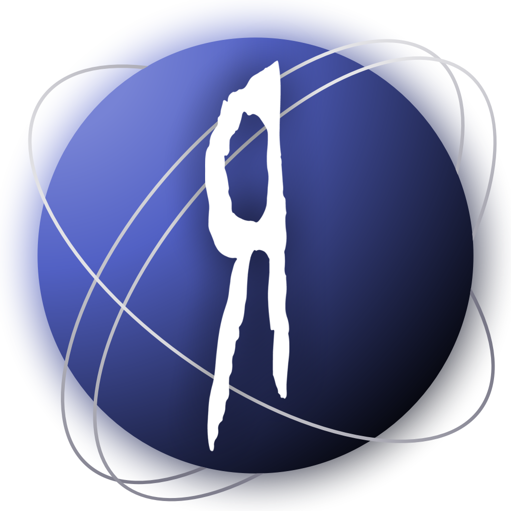

# Kornucopia



An unofficial, single page, interactive website for the nu metal band
[Korn](https://wikipedia.org/wiki/Korn).

Kornucopia is written as pre-coursework for A level Computer Science.

## Table of contents

* [Kornucopia](#kornucopia)
  * [Table of contents](#table-of-contents)
  * [Documentation](#documentation)
  * [Server dependencies](#server-dependencies)
  * [Development server](#development-server)
    * [Standalone](#standalone)
    * [VS Code](#vs-code)
    * [Static assets](#static-assets)
  * [Production server](#production-server)
    * [Configuration](#configuration)
    * [Building](#building)
  * [Project structure](#project-structure)
    * [Code](#code)
  * [Debugging](#debugging)
    * [Additional dependencies](#additional-dependencies)
    * [VS Code](#vs-code-1)
  * [Known issues](#known-issues)
  * [License](#license)
  * [Asset licenses](#asset-licenses)
    * [CC BY-SA 4.0](#cc-by-sa-40)
    * [Other](#other)

## Documentation

* The documented development envrionments are
  [Visual Studio Code](https://code.visualstudio.com/) and standalone shell with
  a text editor.
* POSIX shell commands to be run as user are denoted by shell code blocks.
* 'Visual Studio Code' and 'Code - OSS' are collectively abbreviated to VS Code.
* Documentation and code symbols are written in United States English for
  integration with different programs and frameworks.

## Server dependencies

- `node` >= 18
- `yarn`

## Development server

The local server runs on http://localhost:PORT, where the PORT is set by the
`PORT` environment variable or 8080 by default. The target browsers for
development are [Chromium](https://www.chromium.org/Home/) (version 100 and
newer), and [Mozilla Firefox](https://www.mozilla.org/en-GB/firefox/) (version
100 and newer).

### Standalone

```shell
yarn install && yarn serve
```

### VS Code

* Run Build Task (`Start development environment`)
  * To (re)start the server after environment initialization, run the
    `Start development` task
      * Default keybind: `shift + ctrl/cmd + b`

### Static assets

Assets hosted by the server are only updated on the server when referenced as
native URLs (not strings) in client code. If the content of a static asset has
changed, however is only referenced by a string, the server must be restarted
for the new content to be displayed.

## Production server

### Configuration

To host a production server, build and serve `dist/` as the server root or as an
[Apache](https://apache.org/)-served directory. If the directory is not the
server root, set the `PUBLIC_PREFIX` environment variable to the location of the subdirectory in which the site's files will reside, relative to the server root.

### Building

```shell
yarn install && yarn build
```

## Project structure

* Source code is located in `src/`.
* Non-source code data is located in `assets/`.

### Code

* Written in HTML, [SCSS](https://sass-lang.com/), and
  [TypeScript](https://www.typescriptlang.org/).
* Built using [Yarn](https://yarnpkg.com/) and [Parcel](https://parceljs.org/).
* Lines are no longer than 80 characters, unless readability or paths are
  affected.
* Tab width is 4 spaces, excluding generated files such as `package.json` in
  which the default of a given tool is used.

## Debugging

### Additional dependencies

* `chromium` >= 100

### VS Code

* Run the default launch task (`Launch Chrome against localhost`)
    * Default keybind: `F5`

## Known issues

* Code is uncommented

## License

Copyright (c) 2022 The Kornucopia Authors.

This program is free software: you can redistribute it and/or modify
it under the terms of the GNU General Public License as published by
the Free Software Foundation, either version 3 of the License, or
(at your option) any later version.

This program is distributed in the hope that it will be useful,
but WITHOUT ANY WARRANTY; without even the implied warranty of
MERCHANTABILITY or FITNESS FOR A PARTICULAR PURPOSE. See the
GNU General Public License for more details.

You should have received a copy of the GNU General Public License
along with this program. If not, see <https://www.gnu.org/licenses/>.

Written by Natalie Wiggins.

See `LICENSE` and `AUTHORS` for more information.

## Asset licenses

### CC BY-SA 4.0

Website text content and the Kornucopia icon (`assets/src/icon.kra`,
`assets/icons/*`) are copyright (c) 2022 The Kornucopia Authors under the terms
of the Creative Commons Attribution-ShareAlike 4.0 International
([CC BY-SA 4.0](https://creativecommons.org/licenses/by-sa/4.0/))] license.

You are free to:
* Share — copy and redistribute the material in any medium or format
* Adapt — remix, transform, and build upon the material
  for any purpose, even commercially.

Created by Natalie Wiggins.

### Other

The Korn logo (`assets/images/korn_logo.png`) is copyright (c) Korn.

The 'Kornucopia' font (`assets/fonts/kornucopia.ttf`) is an existing unlicensed
font unrelated to the Kornucopia project. The style of this font was created by
Jonathan Davis and Korn.

Cover art for the albums *Korn* (1994), *Life is Peachy* (1996),
*Follow the Leader* (1998), *Issues* (1999), *Untouchables* (2002), and
*Take a Look in the Mirror* (2003) are copyright (c) Sony BMG Music
Entertainment, all rights reserved.

Cover art for the albums *See You on the Other Side* (2005), *\[Untitled\]*
(2007), and *The Paradigm Shift* (2013) are copyright (c) Universal Music Group,
all rights reserved.

Cover art for the albums *Korn III: Remember Who You Are* (2010),
*The Path of Totality* (2011), *The Serenity of Suffering* (2016), and
*The Nothing* (2019) are copyright (c) Roadrunner Records, all rights reserved.

Cover art for the album *Requiem* (2022) is copyright (c)
Loma Vista Recordings / Concord, all rights reserved.

All aformentioned cover art is located under `assets/images/cover_art/`.

Images of band members are Public Domain (`assets/static/images/members/*/*`).
